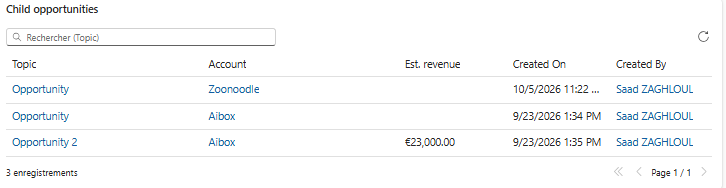

# HierarchyRelatedGrid

A read-only **Power Apps component (PCF)** for **model-driven apps** that displays, on a parent record, the related records of **the whole hierarchy below it**.

Typical use case: on a parent account, list the opportunities (or cases, activities, contacts, custom table rows…) of all its child accounts, grand-child accounts, and so on — without aggregating anything, just a sub-grid.

<p align="center">
  
  <br />
  <em>On a parent account: the opportunities of its child accounts, with the account each one belongs to, quick search and paging.</em>
</p>

## Features

- Works with **any table** related to a **hierarchical table** (account by default, or any custom table with a hierarchical relationship).
- Columns, filters and default sort come from a **system view** you choose.
- Option to **include or exclude the current record** (`eq-or-under` vs `under` hierarchical operators).
- Optional column showing the **hierarchy record each row belongs to**.
- **Server-side** paging, sorting and quick search: scales to large hierarchies.
- Click a name, double-click a row or press Enter to open the record (Ctrl+click: new window); lookup columns are clickable.
- Built with React & Fluent UI v9 (platform libraries), follows the app theme.
- Multilingual: the grid and its properties follow the user's UI language (English and French included, English as fallback). Column headers and values come from Dataverse in the user's language.

## Download

Get the latest solution from the [Releases](../../releases) page:

| File | Use |
|---|---|
| `HierarchyRelatedGrid_x.y.z_managed.zip` | Recommended for test / production environments |
| `HierarchyRelatedGrid_x.y.z_unmanaged.zip` | For development environments, if you want to customize it |

Import it in **Power Apps > Solutions > Import solution**.

## Configuration

1. Open the form of the hierarchical table (e.g. account) in the form designer.
2. Add any field (e.g. *Account Name*) in a dedicated section and hide its label.
3. Select the field, **+ Component**, choose **Hierarchy related records**.
4. Set the properties:

| Property | Required | Example | Description |
|---|---|---|---|
| Host field | yes | `name` | Form field hosting the component. Its value is neither read nor modified. |
| View ID | yes | `00000000-0000-…` | GUID of the system view (`savedquery`) or personal view (`userquery`) to display. Defines the table, columns, filters and default sort. |
| Lookup to the hierarchy | yes | `parentaccountid`, `customerid`, `regardingobjectid` | Lookup of the displayed table pointing to the hierarchical table. |
| Hierarchical table | no | `account` | Defaults to the form table. |
| Include current record | yes (Yes) | Yes / No | Also show the records related to the current record itself. |
| Show parent record column | yes (Yes) | Yes / No | Adds a column showing which hierarchy record each row belongs to. |
| Rows per page | no (25) | 5 – 250 | Server-side page size. |

Configuration examples:

| Need | View | Lookup |
|---|---|---|
| Opportunities of child accounts | *Open Opportunities* | `parentaccountid` (or `customerid`) |
| Cases of child accounts | *Active Cases* | `customerid` |
| Activities of child accounts | *All Activities* (activitypointer) | `regardingobjectid` |
| Contacts of child accounts | *Active Contacts* | `parentcustomerid` |

> Tip: the view filters are kept. Avoid views such as *My Opportunities*, which would hide the records owned by other users.

## How it works

The component loads the view FetchXML and adds an inner join on the hierarchical table, filtered with a hierarchical operator on the current record:

```xml
<link-entity name="account" from="accountid" to="{lookup}" link-type="inner" alias="hrg_hier">
  <filter>
    <condition attribute="accountid" operator="eq-or-under" value="{current record id}" />
  </filter>
</link-entity>
```

Requirements and limits:

- The self-referencing relationship of the hierarchical table must be marked as **hierarchical** (default for `account.parentaccountid`).
- Dataverse limits hierarchical queries to 100 levels.
- Standard Dataverse security applies: queries run through the Web API as the current user.
- Record count is exact up to 5,000 (displayed as *5,000+* beyond); paging still works past that.
- One table per component instance; sorting is available on the main table columns only.
- The FetchXML is sent in a GET request: extremely large views (FetchXML over ~30 KB) are not supported.

## Build from source

Prerequisites: Node.js 20+, .NET SDK 8+, [Power Platform CLI](https://learn.microsoft.com/power-platform/developer/cli/introduction).

```bash
npm ci
npm run build
```

Deploy to a dev environment:

```bash
pac pcf push --publisher-prefix sza
```

Build managed and unmanaged solutions (output in `Solution/bin/Release`):

```bash
dotnet build Solution/Solution.cdsproj -c Release
```

## Releasing

Releases are built by GitHub Actions ([`.github/workflows/release.yml`](.github/workflows/release.yml)). Pushing a tag `vX.Y.Z` sets the control and solution version to `X.Y.Z`, builds both solutions and attaches them to a GitHub release:

```bash
git tag v1.0.2
git push origin v1.0.2
```

## License

[MIT](LICENSE)
